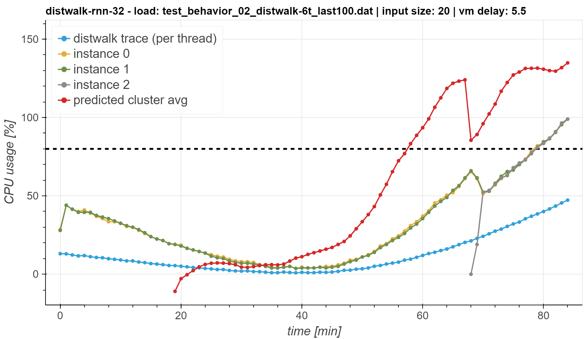
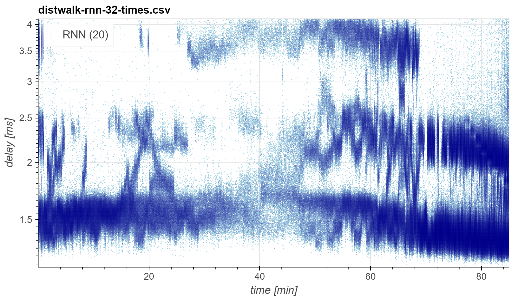

[](https://github.com/giacomolanciano/UCC2021-predictive-auto-scaling-openstack/blob/master/LICENSE)
[](https://zenodo.org/badge/latestdoi/420148162)

# Predictive Auto-scaling with OpenStack Monasca

[Giacomo Lanciano](mailto:giacomo.lanciano@sns.it)\*, Filippo Galli, Tommaso Cucinotta, Davide Bacciu, Andrea Passarella<br>
2021 IEEE/ACM 14th International Conference on Utility and Cloud Computing (UCC)<br>

*Abstract:* Cloud auto-scaling mechanisms are typically based on *reactive* automation rules that scale a cluster
whenever some metric, e.g., the average CPU usage among instances, exceeds a predefined threshold. Tuning these rules
becomes particularly cumbersome when scaling-up a cluster involves non-negligible times to bootstrap new instances, as
it happens frequently in production cloud services.<br>
To deal with this problem, we propose an architecture for auto-scaling cloud services based on the status in which the
system is expected to evolve in the near future. Our approach leverages on time-series forecasting techniques, like
those based on machine learning and artificial neural networks, to predict the future dynamics of key metrics, e.g.,
resource consumption metrics, and apply a threshold-based scaling policy on them. The result is a *predictive*
automation policy that is able, for instance, to automatically anticipate peaks in the load of a cloud application and
trigger ahead of time appropriate scaling actions to accommodate the expected increase in traffic.<br>
We prototyped our approach as an open-source OpenStack component, which relies on, and extends, the monitoring
capabilities offered by Monasca, resulting in the addition of predictive metrics that can be leveraged by orchestration
components like Heat or Senlin. We show experimental results using a recurrent neural network and a multi-layer
perceptron as predictor, which are compared with a simple linear regression and a traditional non-predictive
auto-scaling policy. However, the proposed framework allows for the easy customization of the prediction policy as
needed.

*DOI:* [10.1145/3468737.3494104](https://doi.org/10.1145/3468737.3494104)

\* *contact author*

## Requirements

In what follows, we provide instructions to install the required dependencies, assuming a setup that is similar to our
testing environment.

The test-bed used for our experiments is a Dell R630 dual-socket, equipped with: 2 Intel Xeon E5-2640 v4 CPUs (2.40 GHz,
20 virtual cores each); 64 GB of RAM; Ubuntu `20.04.2 LTS` operating system; version `4.15.0-122-generic` of the Linux
kernel.

### Data

[](https://doi.org/10.5281/zenodo.5618882)

The data used for this work are [publicly available](https://zenodo.org/record/5618882/files/UCC2021-data.tar.bz2). We
recommend using our utility to automatically download, decompress and place such data in the location expected by our
tools. To do that, make sure the required dependencies are installed by running

```bash
apt-get install pbzip2 tar wget
```

To start the download utility, run `make data` from the root of this repo. Once the download terminates, the following
files are placed under `data/`:

| File                                                    | Description                                                    |
| :------------------------------------------------------ | :------------------------------------------------------------- |
| `amphora-x64-haproxy.qcow2`                             | Image used to create Octavia amphorae                          |
| `distwalk-{lin,mlp,rnn,stc}-<INCREMENTAL-ID>.log`       | `distwalk` run log                                             |
| `distwalk-{lin,mlp,rnn,stc}-<INCREMENTAL-ID>-pred.json` | Predictive metric data exported from Monasca DB                |
| `distwalk-{lin,mlp,rnn,stc}-<INCREMENTAL-ID>-real.json` | Actual metric data exported from Monasca DB                    |
| `distwalk-{lin,mlp,rnn,stc}-<INCREMENTAL-ID>-times.csv` | Client-side response time for each request sent during a run   |
| `model_dumps/*`                                         | Dumps of the models and data scalers used for the validation   |
| `predictor.log`                                         | `monasca-predictor` log                                        |
| `predictor-times.log`                                   | `monasca-predictor` log (timing info only)                     |
| `predictor-times-{lin,mlp,rnn}.{csv,log}`               | `monasca-predictor` log (timing info only, group by predictor) |
| `super_steep_behavior.csv`                              | Dataset used to train MLP and RNN models                       |
| `test_behavior_02_distwalk-6t_last100.dat`              | `distwalk` load trace                                          |
| `ubuntu-20.04-min-distwalk.img`                         | Image used to create Nova instances for the scaling group      |

### Python

To be able to run all the parts of this work, the following Python versions must be installed:

| Version  | Usage                                                                           |
| :------- | :------------------------------------------------------------------------------ |
| `3.7.10` | To run `monasca-predictor`                                                      |
| `3.8.5`  | To install OpenStack (with Kolla) and run the Python code included in this repo |

Consider using a tool like [`pyenv`](https://github.com/pyenv/pyenv) to easily install and manage multiple Python
versions on the same system.

### OpenStack

OpenStack `victoria` version is required to run our predictive auto-scaling strategy. On top of the other core OpenStack
services, we leverage on the following:

- Heat
- Monasca
- Nova
- Octavia
- Senlin

Follow the [OpenStack documentation](https://docs.openstack.org/victoria/install/) to install the required services.

Alternatively, this repo includes (under `openstack/`) the config files we used to set up an all-in-one OpenStack
containerized deployment using [Kolla](https://docs.openstack.org/kolla/victoria/) (`victoria` version). Follow the
[`kolla-ansible` documentation](https://docs.openstack.org//kolla-ansible/victoria/doc-kolla-ansible.pdf) to decide on
how to fill the fields marked as `TO BE FILLED` in the such files. Then, assuming the following command to be issued
from the `openstack/` directory (unless otherwise specified), deploy OpenStack by applying these steps:

1. Install Kolla dependencies by running `./install-deps.sh`. [Docker](https://docs.docker.com/engine/install/ubuntu/)
   is also required and must be installed separately.

2. Build the required Kolla images by running `./kolla-build-images.sh`.

3. Start the deployment process by running `./kolla-start-all-nodes.sh`.

Once the deployment is up and running, assuming the following command to be issued from the root of this repo (unless
otherwise specified), complete the configuration by applying these steps:

1. Create an SSH key-pair to be used for accessing the instances in the scaling group:

   ```bash
   ssh-keygen -t rsa -b 4096
   ```

2. Initialize the current OpenStack project by deploying the resources defined in the `openstack/heat/init.yaml` Heat
   Orchestration Template (HOT):

   ```bash
   openstack stack create --enable-rollback --wait \
       --parameter admin_public_key="<PUBLIC-SSH-KEY-TEXT>" \
       -t openstack/heat/init.yaml init
   ```

   **NOTE:** the other parameters concerning networking configs are provided with default values that makes sense on our
   test-bed. Consider reviewing them before deploying.

3. Upload the image to be used for creating the instances in the scaling group:

   ```bash
   openstack image create \
       --container-format bare \
       --disk-format qcow2 \
       --file data/ubuntu-20.04-min-distwalk.img \
       --public \
       ubuntu-20.04-min-distwalk
   ```

4. As it is the case for our test-bed, Octavia may get stuck at creating amphorae due to the provider network subnet
   being different from the host network. When experiencing similar issues, try and apply our workaround by running
   `./octavia-setup.sh` from the `openstack/` directory.

### monasca-predictor

We use [`monasca-predictor`](https://github.com/giacomolanciano/monasca-predictor) to provide OpenStack Monasca with
forecasting capabilities and enable a predictive auto-scaling strategy. To install the specific version used for our
experiments (i.e., version `0.1.0`), assuming that `python3.7` points to version `3.7.10`, run

```bash
apt-get install python3.7-venv
git clone https://github.com/giacomolanciano/monasca-predictor
cd monasca-predictor
git checkout v0.1.0
make py37
```

The `monasca-predictor` command can now be issued from within the newly created virtual env, that can be activated by
running

```bash
source .venv/py37/bin/activate
```

### distwalk

We use [`distwalk`](https://github.com/tomcucinotta/distwalk) to generate traffic on the scaling group. To install the
specific version used for our experiments (i.e., commit `8092994`), run

```bash
git clone https://github.com/tomcucinotta/distwalk
cd distwalk
git checkout 8092994
make
```

The binaries for the client and server modules (`client` and `node`, respectively) will be generated under
`distwalk/src/`.

### Jupyter

This repo includes Jupyter notebooks. To install JupyterLab, assuming that `pip3` is the version of `pip` associated
with Python `3.8.5`, run

```bash
pip3 install -U pip
pip3 install jupyterlab==3.1.12 jupytext==1.11.2
```

Notice that we leverage on `jupytext` such that each notebook is paired (and automatically kept synchronized) with an
equivalent Python script, that is what is actually versioned in this repo. To configure `jupytext` accordingly, append
the following lines to your Jupyter configs (e.g., `~/.jupyter/jupyter_notebook_config.py`):

```python
c.ContentsManager.allow_hidden = True
c.ContentsManager.comment_magics = True
c.ContentsManager.default_jupytext_formats = "ipynb,py:percent"
c.NotebookApp.contents_manager_class = "jupytext.TextFileContentsManager"
```

**NOTE:** To open a paired Python script as a notebook from JupyterLab, right-click on the script and then click on
"Open With" > "Notebook".

## Running the notebooks

The notebooks included in this repo can be used to visualize the results of the runs, as well as to train the
time-series forecasting models used in this work. Here is a summary of what can be found under `notebooks/`:

| File                  | Description                                                                                                  |
| :-------------------- | :----------------------------------------------------------------------------------------------------------- |
| `common.py`           | Module containing common utility functions                                                                   |
| `constants.py`        | Module containing constant values (e.g., metadata about the performed runs)                                  |
| `results_load.py`     | Notebook that plots the time-series exported from Monasca DB                                                 |
| `results_overhead.py` | Notebook that produces a table regarding the average overhead imposed by `monasca-predictor`                 |
| `results_times.py`    | Notebook that plots `distwalk` client-side response times and produces a table regarding their distributions |
| `train_mlp.py`        | Notebook that allows for training an MLP                                                                     |
| `train_rnn.py`        | Notebook that allows for training an RNN                                                                     |

To run the notebooks, it is necessary to set up a virtual env to be used as a kernel, by running `make py38` from the
root of this repo. Once the command terminates, a new kernel named `pred-as-os` will be available for the current user.
The notebooks are set to use this kernel by default.

Example of output generated by `results_load.py`:



Example of output generated by `results_times.py`:



## Launching a new run

We assume all the following commands to be issued from the root of this repo (unless otherwise specified). Here are the
steps to apply to launch a new run:

0. Make sure the current user is provided with credentials granting full-access to an OpenStack project that was
   initialized according to the [provided instructions](#openstack).

1. Deploy the required OpenStack resources using the `openstack/heat/senlin-auto-scaling.yaml` HOT. To use our proposed
   **predictive** auto-scaling strategy, run:

   ```bash
   openstack stack create --enable-rollback --wait \
       --parameter auto_scaling_enabled=true \
       --parameter scale_out_metric=pred.group.sum.cpu.utilization_perc  \
       -t openstack/heat/senlin-auto-scaling.yaml senlin
   ```

   Alternatively, to use the **static** auto-scaling strategy, run:

   ```bash
   openstack stack create --enable-rollback --wait \
       --parameter auto_scaling_enabled=true \
       -t openstack/heat/senlin-auto-scaling.yaml senlin
   ```

   **NOTE:** after the stack is created, the system will not be ready to handle requests until the time we configured to
   defer the start of the `distwalk` server in each scaling group instance (i.e., **5.5 minutes**) has passed. This is
   done to simulate a production-like scenario, where required resources take a non-negligible time to be configured. It
   is possible to send requests to the system as soon as the `operating_status` of the load-balancer turns to `ONLINE`.
   Such condition can be checked with the following command:

   ```bash
   $ openstack loadbalancer status show <OCTAVIA-LB-ID>
   {
      "loadbalancer": {
         "id": "<OCTAVIA-LB-ID>",
         "name": "<OCTAVIA-LB-NAME>",
         "operating_status": "ONLINE",
         "provisioning_status": "ACTIVE",
   [...]
   ```

2. Copy `config.conf.template` to `config.conf` and fill in the fields marked as `TO BE FILLED`.

3. When using the **predictive** strategy, copy `predictor.yaml.template` to `predictor.yaml` and fill in the fields
   marked as `TO BE FILLED`. In particular, use the same configs of `monasca-agent` subcomponents where specified (e.g.,
   after installing OpenStack with Kolla, such config files can be found under `/etc/kolla/monasca-agent-*`). In
   addition, make sure to correctly specify the type of time-series forecasting model (and the data scaler) to be used.

4. Open two terminal windows to launch `distwalk` and `monasca-predictor` (when using the **predictive** strategy)
   separately.

   **NOTE:** we expect the user to launch the two processes (as explained in the following steps) in rapid succession.
   However, our `distwalk` load trace is designed such that we can tolerate even a few minutes delay between the two, as
   long as `distwalk` is started **before** `monasca-predictor`, without affecting the interesting parts of the results
   of a run.

5. To launch `distwalk`, use `run.sh` specifying a log file named according to the following convention, depending on
   the chosen time-series forecasting model type:

   ```bash
   ./run.sh --log data/distwalk-{lin,mlp,rnn,stc}-<INCREMENTAL-ID>.log
   ```

   The other output files will be created under `data/` and named accordingly. Such naming convention is the one
   expected by the provided Jupyter notebooks to automatically plot the results of the new run. When using the
   predefined `distwalk` load trace, this process will take **~1.5 hours** to terminate.

6. Activate the `monasca-predictor` virtual env (see [provided instructions](#monasca-predictor)) and launch it by
   running

   ```bash
   sleep 1200; monasca-predictor -f predictor.yaml
   ```

   **NOTE:** we defer the start of `monasca-predictor` until **20 minutes** (i.e., our default input size for the
   time-series forecasting algorithm) have passed, such that the results of the run are not affected by load on the
   system prior to the start of the run. The logs will be saved in the file specified in `predictor.yaml`.

7. When `distwalk` terminates, stop `monasca-predictor` as well by pressing `CTRL`-`C`.

8. To load the results of the new run in the notebooks, add an entry to `notebooks/constants.py`, depending on
   the chosen time-series forecasting model type, using the following structure:

   ```json
   ### TO BE FILLED (use the same ID of distwalk log) ###
   <INCREMENTAL-ID>: {
        "load_profile": "test_behavior_02_distwalk-6t_last100.dat",

        ### TO BE FILLED (see tail of distwalk log) ###
        "start_real": ...,

        ### TO BE FILLED (see tail of distwalk log) ###
        "end_real": ...,

        ### TO BE FILLED (see predictor.yaml, use dump file basename) ###
        "model": ...,

        ### TO BE FILLED (see predictor.yaml, use dump file basename) ###
        "scaler": ...,

        "input_size": 20,
   },
   ```

   **NOTE:** After editing `notebooks/constants.py`, it may be necessary to restart the notebook kernels to fetch the
   update.

## Citation

Please consider citing:

```bibtex
@inproceedings{Lanciano2021Predictive,
  author={Lanciano, Giacomo and Galli, Filippo and Cucinotta, Tommaso and Bacciu, Davide and Passarella, Andrea},
  booktitle={2021 IEEE/ACM 14th International Conference on Utility and Cloud Computing (UCC)},
  title={Predictive Auto-scaling with OpenStack Monasca},
  year={2021},
  doi={10.1145/3468737.3494104},
}
```
